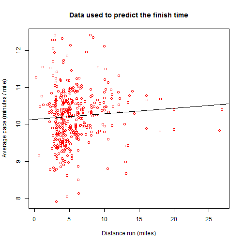

## Preparing for races

Typical pre-race preparation for a runner

- Gather all the gear that will be used in the race
- Plan the race splits based on the estimated running time
- Calculate and gather the nutrition requirements (if any) of the race

The running predictor helps with the second item, by taking the training data
from the runners and predicting the finish time for a race in the future.

--- .class #id1 

## The running predictor

Linear model based on hundreds of training runs, that are used to predict the finishing time of an upcoming race

 

--- .class #id2 

## User options

- Race distance
    - The distance for the race you want to predict the finishing time, in miles. Common values are 3.1 (5k), 6.2 (10k), 13.1 (half marathon) and 26.2 (marathon)
- First year of training data
    - The training data set used to build the model has data for the past 4 years, but restricting it to most recent results may yield a better estimate of the user's current physical conditions
- Course difficulty
    - Some races are harder than others, due to factors like elevation or climate. The user can use this option to better predict their finish time.
- Training pace
    - Some training runs are done in a higher or lower pace than the expected effort; this option can limit the runs used in the training to only those within a certain pace range.

--- .class #id3

## Using the app

- Browse to [https://carlosfigueira.shinyapps.io/RunningPredictor](https://carlosfigueira.shinyapps.io/RunningPredictor)
- Enter the race and training information
- Find out the predicted race time
- Prepare the race plan based on it
- Enjoy!
